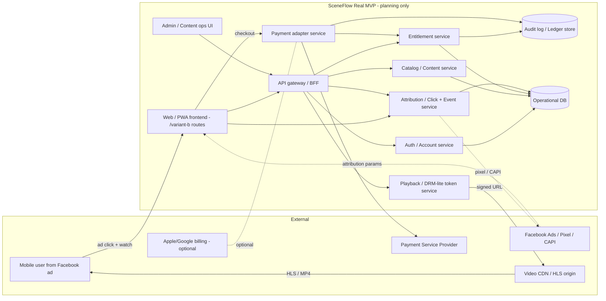

# SceneFlow Real MVP — Target Architecture (Planning Only)

- Document: **Phase 4 real MVP architecture**, mock-only / planning-only. No production infrastructure is built or authorized by this document.
- Linked task: PHASE4-002 (`t_a6966573`).
- Status: Planning draft. No production infrastructure, payment, login, Facebook API, analytics, backend, database, video, or entitlement system is built or prescribed by this document.
- Phase: Real MVP architecture gate. Outputs are docs only.
- Source of truth (product): `docs/moboreels/scene-flow-facebook-ad-conversion-prd.md`.
- Mock-only baseline evidence: `docs/moboreels/phase3-acceptance/` (walkthrough, checklist, mock-data freeze, known issues).
- Companion docs: `docs/moboreels/real-mvp/gap-risk-register.md` (feasibility / gap analysis); `.hermes/artifacts/phase3-014-review-verdict.md` (Phase 3 acceptance verdict).
- Authoring role: ARCHITECT (planning only).
- Owner: Product / Engineering Architecture.
- Last updated: 2026-05-17.
- Implementation status: Not started. Each "Future / real" component below is gated by §8 approval gates.

> This document defines what the real MVP could look like once it leaves the mock-only prototype and enters a real, customer-facing build. It does **not** authorize any of that work to start. NovelHub is referenced only as a future infrastructure pattern; nothing here assumes NovelHub production infra is available, required, or chosen.

---

## 0. Architectural goals and non-goals

### 0.1 Goals

1. Preserve the watch-first Facebook ad conversion route `/variant-b/watch/[showId]?episode=1&source=facebook` as the immovable primary landing experience and the architectural anchor for every later phase.
2. Treat the Phase 3 acceptance result (PRD §15, 30/30 PASS in `docs/moboreels/phase3-acceptance/checklist.md`) as an immovable regression baseline; later phases extend the architecture without invalidating that evidence.
3. Make the boundary between "mock prototype" and "future real integration" explicit at the file/module level so the codebase cannot accidentally cross a hard stop by incremental drift.
4. Define stable data contracts (TypeScript types, query-param shape, unlock-result / pass-state shape, attribution shape) so any future real backend has a fixed surface to implement against.
5. Define phased build gates (P0 hardening → P1 real-MVP readiness → P2 production integration) where each phase has acceptance evidence and an explicit human-decision checkpoint before the next phase begins.
6. Preserve the PRD invariants under every future integration: free preview without login / prompts, per-drama lock from `freeEpisodes`, single-episode unlock as primary CTA, same-episode return after unlock.

### 0.2 Non-goals

1. Reopening the A/B/C/D/E prototype direction discussion (PRD §3).
2. Building or wiring real payment, subscription, login, Facebook API, video, backend, database, entitlement, or analytics in this phase.
3. Replacing the URL-flag mock unlock (`unlocked=1`) with a real entitlement check inside the existing static-export branch — that crossing is a P2 gate (§8).
4. Choosing a production runtime (static export vs server runtime), hosting provider, CDN, payment processor, auth provider, or video provider. Each is a separate gated decision in §8.
5. Removing mock disclaimers or copy that currently protect the mock boundary in stakeholder surfaces, before product / legal sign-off.
6. Touching the Phase 3 accepted artifacts or the accepted P0 route behavior.
7. Implementing NovelHub production infrastructure. NovelHub remains reference-only.

---

## 1. Mock-only baseline and target real-MVP boundary

### 1.1 Current mock-only baseline (Phase 3)

What exists today, per Phase 3 acceptance evidence:

- A Next.js / static-export web prototype routed under `/variant-b/...`.
- The P0 Facebook ad conversion route works end-to-end against mock data:
  - `/variant-b/watch/[showId]?episode=1&source=facebook` lands directly on EP1.
  - EP1–EP5 free chain, EP6 first locked, Unlock Drawer, mock single-episode unlock, mock Story Pass — all return to the same watch episode with `unlocked=1`.
- Show, episode, balance, and cost values are frozen static fixtures (`src/data/fixtures/shows.ts`), e.g. `midnight-lantern-oath`, 36 episodes, `freeEpisodes: 5`, balance `80 coins`, cost `36 coins`, mock Story Pass `120 coins`.
- No login, no payment, no real video, no Facebook API, no backend, no database, no analytics, no production entitlement, no production deployment, no DNS, no secrets.

Acceptance evidence is recorded in:

- `docs/moboreels/phase3-acceptance/walkthrough.md`
- `docs/moboreels/phase3-acceptance/checklist.md`
- `docs/moboreels/phase3-acceptance/mock-data-freeze.md`
- `docs/moboreels/phase3-acceptance/known-issues.md`

### 1.2 Real MVP boundary

The real MVP is the first version where a real Facebook ad click on a real ad account leads a real user to actually watch a real episode and complete a real purchase, with a real audit trail. To get there from the mock baseline, the following classes of system cross the boundary from "mock" to "real":

| Capability                  | Mock-only baseline (today)                                 | Real MVP boundary (target)                                                            | Decision gate before build |
| --------------------------- | ---------------------------------------------------------- | ------------------------------------------------------------------------------------- | -------------------------- |
| Web / PWA frontend          | Static export of `/variant-b/...` routes against fixtures. | Same routes, fed by an API and a real video provider; PWA polish per PRD §9.          | Engineering lead.          |
| Catalog / episodes          | TypeScript fixtures committed to repo.                     | Catalog service exposing shows, episodes, free-episode rule, hooks, status.           | Content + Engineering.     |
| Playback                    | Mock placeholder card with mock progress.                  | Real video provider (HLS/MP4 over CDN) behind an entitlement-gated playback URL.      | Video / Infra + Legal.     |
| Account / identity          | Anonymous device state in URL/localStorage.                | Account service; deferred login at purchase boundary; anonymous→account merge.        | Security + Privacy.        |
| Entitlement                 | URL flag `unlocked=1`.                                     | Entitlement service holding per-user single-episode unlocks and pass/subscription.    | Engineering + Finance.     |
| Payment                     | None; mock CTA.                                            | One real PSP (Stripe / Apple / Google) behind a payment adapter; no double charge.    | Finance + Legal + Compliance. |
| Subscription / Story Pass   | Static `120 coins` mock copy.                              | Real subscription with renewal, cancellation, refund handling.                        | Finance + Legal + Compliance. |
| Attribution                 | URL params accepted but unused.                            | Click ingestion + (optionally) Facebook Pixel + CAPI; user→click join.                | Marketing + Privacy + Legal. |
| Analytics events            | None.                                                      | Funnel events for PRD §10 metrics; deduplicated, exportable.                          | Data + Privacy.            |
| Admin / content ops         | Edit fixtures in source.                                   | Admin surface to publish/unpublish shows and episodes, tune free-episode rules, hooks. | Engineering + Content.     |
| Support / refund            | None.                                                      | Refund/revocation tools; ledger; reconciliation against PSP.                          | Finance + Support + Legal. |
| Deployment / infra          | Local static preview only.                                 | Production deployment, DNS, secrets management.                                       | **§9 deployment gate.**    |

The first eight rows form the **real MVP critical path**. Admin, support, and infra rows are required for the real MVP to be operable but may be the thinnest viable cuts at launch (e.g., manual ops via a database console + a refund runbook).

### 1.3 Source-of-truth invariants

These invariants are extracted from the PRD, the prototype spec, and the Phase 3 acceptance pack. They bind every later phase regardless of which production integration is eventually selected. Every architectural decision in §2–§8 below must preserve them.

| #     | Invariant                                                                                                                                                                                                                                       | Source                                                                                                                                       |
| ----- | ----------------------------------------------------------------------------------------------------------------------------------------------------------------------------------------------------------------------------------------------- | -------------------------------------------------------------------------------------------------------------------------------------------- |
| I-01  | The primary ad landing route is `/variant-b/watch/[showId]?episode=1&source=facebook`.                                                                                                                                                          | PRD §2, §7.1                                                                                                                                 |
| I-02  | Facebook ad users must not be sent to Home, Search, or Show Detail before watching.                                                                                                                                                             | PRD §3, §5.1                                                                                                                                 |
| I-03  | Free preview episodes must play without login, recharge prompt, Story Pass prompt, subscription prompt, or PWA install prompt.                                                                                                                  | PRD §5.2, §8.1, §9                                                                                                                           |
| I-04  | The first locked episode is determined per drama by `freeEpisodes` (`episode > story.freeEpisodes && !unlocked` triggers lock).                                                                                                                 | PRD §5.3, §8.3; `src/lib/lock.ts`                                                                                                            |
| I-05  | The Unlock Drawer is the core P0 conversion component and must show drama title, episode number, balance, cost, primary single-episode unlock CTA, secondary Story Pass CTA, and a tertiary "Maybe later".                                      | PRD §5.4, §8.4                                                                                                                               |
| I-06  | Single-episode unlock is the primary CTA at the first locked episode; Story Pass is secondary.                                                                                                                                                  | PRD §5.5                                                                                                                                     |
| I-07  | After successful unlock (mock or real), the user returns to `/variant-b/watch/[showId]?episode=[episodeNumber]&unlocked=1` (or the server-authoritative equivalent). No Home redirect, no episode loss.                                         | PRD §5.6, §8.6                                                                                                                               |
| I-08  | Closing the drawer keeps the user on the locked episode; tapping the locked playback area reopens the drawer.                                                                                                                                   | PRD §8.3, §8.4                                                                                                                               |
| I-09  | The locked state must be visually distinct from a network error or video failure.                                                                                                                                                               | PRD §8.3; Phase 3 known-issues explicit non-issue                                                                                            |
| I-10  | Attribution params (`source`, `campaign_id`, `adset_id`, `ad_id`, `creative_id`, `placement`, `utm_source`, `utm_campaign`, `utm_content`) must round-trip through every navigation step without disrupting routing or playback.                | PRD §7.1, §14; `src/lib/query-params.ts` `ATTRIBUTION_KEYS`                                                                                  |
| I-11  | The mock unlock state is represented today by `unlocked=1` only. This is **not** a production entitlement, and removing the URL-flag form before a real entitlement service exists is a hard stop.                                              | Gap register risk "Mock URL unlock leaks into production"; PRD §14 Out-of-Scope                                                              |
| I-12  | The frozen primary P0 fixture is `midnight-lantern-oath` (36 episodes, 5 free, first lock EP6, balance 80 coins, cost 36 coins, Story Pass display 120 coins); secondary stubs `harbor-of-second-chances` and `paper-crown-protocol` are non-P0. | `docs/moboreels/phase3-acceptance/mock-data-freeze.md`; `src/data/fixtures/shows.ts`                                                         |
| I-13  | The Phase 3 acceptance evidence pack (checklist 30/30 PASS, walkthrough, screenshots, mock-data freeze, known issues) is the regression baseline. Any change that would invalidate a checklist row must regenerate that row's evidence.         | `.hermes/artifacts/phase3-014-review-verdict.md`                                                                                             |
| I-14  | All real-integration work (payment, login, entitlement, video, Meta API, analytics, backend, database) is gated behind a separate human-approval checkpoint per area (see §8).                                                                  | Gap register §"Stop conditions"                                                                                                              |
| I-15  | `output: 'export'` static-export runtime is locked for P0 and P1. A switch to a server runtime is a P2-gated decision because real payment/auth callbacks typically require server runtime.                                                     | `next.config.mjs`; `.hermes/artifacts/phase3-architecture-note.md`; `docs/moboreels/phase3-phone-preview.md` "Not allowed" list              |

### 1.4 Visual flow schematic for the P0 route

The schematic below is exactly the journey already validated in `docs/moboreels/phase3-acceptance/walkthrough.md` (recording timestamps 0.0s–7.0s) and must remain unchanged by any later architecture work. The component / module references map to the actual repo files listed in §3.0.

```txt
Facebook ad creative
        │
        ▼
GET /variant-b/watch/midnight-lantern-oath?episode=1&source=facebook
        │ (parseWatchQueryParams: episode=1, unlocked=false, attribution={source:'facebook'})
        ▼
WatchPage (src/app/variant-b/watch/[showId]/page.tsx)
        │
        ▼
WatchStub (src/app/variant-b/watch/[showId]/watch-stub.tsx)
        │
        ├── lockState = getEpisodeLockState({episode:1, freeEpisodes:5, unlocked:false}) → 'free'
        ├── render: free-playback state, play/pause, complete CTA
        ▼
[free chain]
  EP1 complete → "Continue to EP2" (Link via buildWatchEpisodeHref)
  EP2..EP5 complete → "Continue to EP[next]"
        │  (each transition preserves attribution and showId via buildWatchEpisodeHref)
        ▼
GET /variant-b/watch/midnight-lantern-oath?episode=6&source=facebook
        │ (parseWatchQueryParams: episode=6, unlocked=false, attribution={source:'facebook'})
        ▼
lockState = 'locked'  ───────────────►  isUnlockDrawerOpen=true (auto-open on first entry)
        │
        ├── locked-boundary placeholder + "Open Unlock Drawer" button (idempotent)
        ├── Unlock Drawer renders: title, EP6, balance 80, cost 36, hook, mock-return copy
        │
        ├── primary  → Link to /variant-b/watch/midnight-lantern-oath?episode=6&source=facebook&unlocked=1
        ├── secondary→ Link to /variant-b/pass?story=midnight-lantern-oath&episode=6&source=facebook
        └── tertiary "Maybe later" → close drawer; locked playback area re-opens drawer
        ▼ (primary)                                ▼ (secondary)
GET .../watch/...?episode=6&...&unlocked=1          GET /variant-b/pass?story=...&episode=6&source=facebook
        │                                              │
        │                                              ├── PassStub: same story/episode context
        │                                              ├── mock single-episode option → unlocked=1 return
        │                                              └── mock Story Pass option → unlocked=1 return
        ▼                                              ▼
lockState = 'unlocked' on EP6 → "Mock unlocked episode" panel; emerald continuation copy
```

Three guarantees the schematic encodes (each enforced by architecture rules in §3 and §6.5):

- **Same-route shape** at every step. The component tree always sits under `/variant-b/watch/[showId]`; only query params change. No future real-integration step is allowed to redirect off-route.
- **One source of truth** for "is this episode playable": `getEpisodeLockState({episode, freeEpisodes, unlocked})` in `src/lib/lock.ts`. The drawer / playback split keys off it exclusively.
- **Same-episode return** is achieved by URL construction, not by mutable client state. That property survives a refresh, a cold load from a shared link, or a deep link from the Pass page.

---

## 2. System context diagram

### 2.1 Real MVP — system context (mermaid)



### 2.2 Plain-text fallback

```
User on Facebook ad
        |
        v
Web / PWA  --->  API gateway  --->  Auth (deferred login)
   |               |                Catalog (shows / episodes)
   |               |                Entitlement (unlocks / pass)
   |               |                Playback (signed video URL)  --->  Video CDN
   |               |                Payment adapter             --->  PSP (Stripe / Apple / Google)
   |               |                Attribution / Events        <-->  Facebook Pixel / CAPI
   |               |
   |               +---> Admin / Content ops UI
   |
   +---> Audit log / Ledger (refund, revocation, reconciliation)
```

### 2.3 Trust boundaries

- **Public, untrusted**: browser, ad params, Pixel client-side calls.
- **Server-side, trusted**: API gateway, services, ledger, admin.
- **Third-party**: PSP, Facebook, CDN, optional NovelHub-style infra patterns (future reference only).
- **Authoritative on entitlement**: entitlement service + ledger. Frontend `unlocked=1` is **never authoritative** in the real MVP.

---

## 3. Recommended target components

Each component below lists: responsibility, what is in scope at real MVP launch, what is explicitly out of scope, and the boundary it must expose. None of this is implemented yet.

### 3.0 Frontend file / module map (current and proposed)

Where functionality should live in the repo, **without** requiring production backend, database, payment, video, or Facebook implementation. The "current" tree is the accepted Phase 3 layout; the "proposed P0 hardening" tree shows the additive refactor in §7's P0 hardening phase. No file is moved or renamed in this refactor — only new files are added and `watch-stub.tsx`/`pass-stub.tsx` are thinned by extracting children.

**Current (Phase 3 accepted, do not move or rename — they are part of the accepted acceptance pack):**

```txt
src/
├── app/
│   ├── layout.tsx
│   ├── page.tsx
│   └── variant-b/
│       ├── layout.tsx
│       ├── page.tsx                              # variant-b index
│       ├── browse/page.tsx
│       ├── search/page.tsx
│       ├── show/[showId]/
│       │   ├── page.tsx
│       │   └── show-stub.tsx
│       ├── watch/[showId]/
│       │   ├── page.tsx                          # server boundary; generateStaticParams over mockShows
│       │   └── watch-stub.tsx                    # client; current home of WatchStub + drawer + sheet
│       └── pass/
│           ├── page.tsx
│           └── pass-stub.tsx
├── data/
│   └── fixtures/
│       └── shows.ts                              # frozen primary + 2 stubs (mock-data-freeze.md)
├── lib/
│   ├── episode-range.ts        + .test.ts
│   ├── episode-sheet.ts        + .test.ts
│   ├── lock.ts                 + .test.ts        # single source of truth for free/locked/unlocked
│   └── query-params.ts         + .test.ts        # parsing + URL builders (attribution round-trip)
└── types/
    └── scene-flow.ts                             # SceneFlowShow, SceneFlowEpisode, etc.
```

**Proposed for P0 hardening (new files only; no behavior change):**

```txt
src/
├── components/                                   # NEW: extract from watch-stub.tsx / pass-stub.tsx
│   └── variant-b/
│       ├── WatchPlayer.tsx                       # free / locked playback surface
│       ├── EpisodeCompleteCta.tsx                # "Continue to EP N"
│       ├── EpisodeSheet.tsx                      # bottom-sheet grid + range tabs
│       ├── UnlockDrawer.tsx                      # pure component, prop contract from §4 / §5.3
│       ├── StoryPassCard.tsx                     # pass-page card; reused by /pass
│       └── MockBoundaryNote.tsx                  # KI-02 disclaimer; rendered ONLY when env flag says so
├── data/
│   ├── fixtures/shows.ts                         # unchanged (frozen)
│   └── providers/                                # NEW: provider seam (§3.11)
│       └── mock/
│           ├── content-provider.ts               # wraps mockShows; returns SceneFlowShow
│           ├── entitlement-provider.ts           # URL-flag implementation only
│           └── attribution-provider.ts           # pass-through only
├── lib/                                          # unchanged
└── types/
    ├── scene-flow.ts                             # unchanged
    └── entitlement.ts                            # NEW: UnlockOutcome, PassState (type-only; §4)
```

Module rules:

- **No new top-level runtime dependencies** in P0 hardening. The banned-deps check (`pnpm check:banned-deps`) must remain green.
- **`watch-stub.tsx` shrinks** to a composition layer that wires URL → provider → presentational components. The drawer, sheet, and player become independently testable.
- **Provider files contain no side effects.** Mock providers are pure functions that take fixtures and return frozen contracts. Side-effectful providers (HTTP, storage, analytics) are P1+ and live under `src/data/providers/fake/*` and `src/data/providers/real/*` respectively (added only when their §8 gate opens).
- **`MockBoundaryNote`** consolidates the debug / mock copy (Phase 3 KI-02) so a single env / build flag can hide it from a stakeholder demo while keeping it visible in QA and developer surfaces. Disclaimer removal is a product / legal decision (§8 G9), never a developer decision.
- **All cross-route navigation** must use the URL builders in `src/lib/query-params.ts` (`buildWatchEpisodeHref`, `buildPassHref`, `buildPassReturnHref`, `buildShowDetailHref`) so attribution survives every hop. New navigations must extend these builders, not bypass them.

Files this architecture explicitly **must not** add in P0/P1 (each requires a §8 gate first):

- No `src/api/*`, no `src/server/*`, no server routes, no edge functions.
- No `src/auth/*`, no session middleware.
- No `src/payment/*`, no checkout shim.
- No `prisma/`, no SQL/migration files, no `.env*` keys for real services.
- No analytics, Meta SDK, video SDK, or storage SDK packages in `package.json`.

### 3.1 Web / PWA frontend

- **Responsibility**: Render PRD §8 surfaces (Watch, Episode Sheet, Unlock Drawer, Story Pass / Pass page, Show Detail, Home/Search/Genre). Preserve PRD invariants: watch-first landing, free preview without login or prompts, transparent unlock, return to same episode with `unlocked=1` (now backed by real entitlement).
- **In scope at launch**: Variant B routes already implemented in the mock; read entitlement from API instead of URL; deferred login modal at the purchase boundary; PWA install prompt at PRD-approved high-intent moments only.
- **Out of scope**: Multi-language UI, recommendation feeds, server-rendered SEO surfaces.
- **Boundary**: HTTPS calls to API gateway; client-side event emit to attribution endpoint; signed video URL fetched only after entitlement check.

### 3.2 API / backend boundary (BFF / gateway)

- **Responsibility**: One stable contract for the frontend. Translates UI calls into service calls; enforces auth and entitlement; carries attribution context.
- **In scope**: Read endpoints for catalog, entitlement, and playback; write endpoints for events, checkout intent, login. Idempotency keys on writes.
- **Out of scope**: Public third-party API; GraphQL federation; cross-tenant routing.
- **Boundary**: REST or RPC over HTTPS; auth via short-lived session token; rate-limited; logs every entitlement decision.

### 3.3 Auth / account service

- **Responsibility**: Anonymous device identity → optional account identity (email / phone / OAuth) at the purchase boundary. Maintains `AccountIdentity` links.
- **In scope at launch**: One real identity method (e.g., email magic link **or** Google OAuth — choose one to keep scope small); anonymous→account merge of prior unlocks; session management.
- **Out of scope at launch**: Multi-factor, social-account linking beyond one provider, enterprise SSO.
- **Boundary**: Issues session tokens; exposes "current user" lookup; emits `account.created` and `account.linked` events.
- **PRD invariants preserved**: free preview must work with anonymous identity only.

### 3.4 Catalog / content service

- **Responsibility**: Authoritative store of `Show`, `Episode`, `freeEpisodes`, hooks, episode ranges. Replaces the frozen fixtures.
- **In scope**: Read API; admin write API; publish/unpublish; per-show locking rule.
- **Out of scope**: Personalization, recommendation, multi-region pricing, licensed/competitor metadata.
- **Boundary**: Read-through cache acceptable; admin writes audited.
- **Migration note**: First import seeds `midnight-lantern-oath` and any other already-frozen originals from `mock-data-freeze.md`. Real licensed content is **out of scope** until §9 brand/legal gate.

### 3.5 Playback / video provider boundary

- **Responsibility**: For an entitled (user, episode) pair, return a short-lived signed playback URL. For free episodes, return the same shape but skip entitlement.
- **In scope**: One delivery format (HLS recommended); short-lived signed URLs; CDN egress logging.
- **Out of scope**: Full DRM (Widevine/FairPlay/PlayReady), live streams, downloads, multi-bitrate ABR tuning beyond defaults.
- **Boundary**: Asks entitlement service before signing; never serves URL without a positive entitlement decision for locked episodes.
- **Hard stop reminder**: Real video infra build is gated; no licensed assets ingested without legal approval.

### 3.6 Payment provider boundary (payment adapter)

- **Responsibility**: Encapsulate exactly one PSP behind an internal interface so the rest of the system never speaks PSP-specific dialect. Handle checkout creation, success webhook, refund call.
- **In scope at launch**: Single-episode unlock purchase, Story Pass / subscription purchase, refund call, webhook with idempotency.
- **Out of scope at launch**: Tax engines, multi-currency, multi-PSP, dunning, in-app purchase reconciliation for both Apple and Google simultaneously.
- **Decision required**: Which PSP, and whether store billing (Apple/Google) is required for PWA path. Flagged in §9.
- **Boundary**: Webhooks signed and verified; idempotency keyed on PSP charge id; never reveals PSP internals to frontend.

### 3.7 Entitlement service

- **Responsibility**: The **only** authority on "may this user watch this episode now?". Stores `Entitlement` records for single-episode unlocks and pass/subscription entitlements. Issues "yes / no + reason" decisions.
- **In scope**: Grant on payment success, revoke on refund, restore on login/account-merge, decision API, list-my-unlocks API.
- **Out of scope**: Gift entitlements, promo codes, family sharing.
- **Boundary**: Reads/writes mediated through transactional DB + ledger entries; never trusts client-supplied flags.
- **Replaces**: the current `unlocked=1` URL flag (kept only as a UI hint after a successful real purchase).

### 3.8 Attribution / analytics events pipeline

- **Responsibility**: Capture ad clicks (with `campaign_id`, `adset_id`, `ad_id`, `creative_id`, `placement`, `utm_*`) and product events (PRD §10 funnel). Join click → user → purchase. Optionally forward conversions to Facebook Pixel and CAPI.
- **In scope at launch**: First-party click + event ingestion, server-side conversion forwarding, basic funnel reporting export, IP/PII handling per privacy gate.
- **Out of scope at launch**: BI warehouse, multi-touch attribution, ML attribution, cohort tooling.
- **Boundary**: Frontend posts events to API; backend forwards a deduplicated server-side copy to Facebook CAPI. Pixel client-side is optional and controlled by consent gate.
- **PRD link**: PRD §10 metrics determine which events are required at launch.

### 3.9 Admin / content ops

- **Responsibility**: Internal-only surface for content team and engineers to publish shows/episodes, edit `freeEpisodes`, hooks, and Story Pass copy; review purchase activity; trigger refunds; revoke entitlements; freeze unsafe content.
- **In scope at launch**: CRUD over catalog, refund/revoke action, basic audit log view, role-gated access.
- **Out of scope at launch**: Approval workflows, multi-environment promotion UI, schedule-based publishing.
- **Boundary**: Authenticated separately from end-user auth; all mutations write to ledger.

### 3.10 Support / refund / reconciliation

- **Responsibility**: People-and-process layer around refunds and disputes. Reconciles PSP charges and refunds against the internal ledger.
- **In scope at launch**: Runbook for refund requests, daily reconciliation report (PSP vs ledger), dispute response checklist.
- **Out of scope at launch**: CRM integration, ticketing system, AI assist.
- **Boundary**: Reads ledger; writes refund actions through admin → payment adapter → PSP; revokes through entitlement service.

### 3.11 Mock vs future integration boundary

Three provider seams hold the mock-to-real boundary. P0 keeps all three pointed at mock fixtures; future phases swap individual seams without touching views. This is the architectural rule that prevents a real-integration line from sneaking into a Phase 3 view by way of a "small edit".

```txt
┌─────────────────────────────────────────────────────────────────┐
│ Views (WatchStub, PassStub, ShowStub, EpisodeSheet, Drawer)     │
└─────────────────────────────────────────────────────────────────┘
            │                  │                       │
            ▼                  ▼                       ▼
   ┌────────────┐     ┌──────────────────┐     ┌──────────────────┐
   │ Content    │     │ Entitlement      │     │ Attribution      │
   │ provider   │     │ provider         │     │ provider         │
   └────────────┘     └──────────────────┘     └──────────────────┘
            │                  │                       │
            ▼                  ▼                       ▼
   ┌────────────┐     ┌──────────────────┐     ┌──────────────────┐
   │ MOCK (P0): │     │ MOCK (P0):       │     │ MOCK (P0):       │
   │  fixtures  │     │ URL flag         │     │ query params     │
   │            │     │ unlocked=1       │     │ pass-through     │
   └────────────┘     └──────────────────┘     └──────────────────┘
            │                  │                       │
            ▼                  ▼                       ▼
   ┌────────────┐     ┌──────────────────┐     ┌──────────────────┐
   │ FAKE (P1): │     │ FAKE (P1):       │     │ FAKE (P1):       │
   │ local JSON │     │ in-memory wallet │     │ local event log  │
   │ or stub API│     │ sim (opt-in)     │     │ (no Pixel/CAPI)  │
   └────────────┘     └──────────────────┘     └──────────────────┘
            │                  │                       │
            ▼                  ▼                       ▼
   ┌────────────┐     ┌──────────────────┐     ┌──────────────────┐
   │ REAL (P2 ─ │     │ REAL (P2 ─       │     │ REAL (P2 ─       │
   │ gated):    │     │ gated):          │     │ gated):          │
   │ CMS / DB / │     │ server           │     │ Pixel + CAPI +   │
   │ video CDN  │     │ entitlement      │     │ consent + dedupe │
   └────────────┘     └──────────────────┘     └──────────────────┘
```

Boundary rules (enforced by code review):

- **Views never branch on "is this real or mock".** They only read from the provider interface, which is shaped by the contracts in §4.
- **Mock providers** live under `src/data/providers/mock/*` (added in P0 hardening). They are pure wrappers around `src/data/fixtures/shows.ts`.
- **Fake providers** live under `src/data/providers/fake/*` (added in P1). They simulate behavior with in-memory or local storage; never speak to a real network.
- **Real providers** live under `src/data/providers/real/*` (added only after the corresponding §8 gate opens for that integration).
- Crossing from mock → fake → real is a per-phase human decision. The crossing must not happen by editing a view to call a new module directly.
- The `unlocked=1` URL flag is the **only** entitlement signal in P0 and P1 by design. A real entitlement service is forbidden from honoring it once the P2 entitlement gate opens (see §6.5 risk "Mock URL unlock leaks into production").

What stays mock at each phase (explicit):

| Field / contract                          | Status in P0       | Status in P1                            | Status in P2 (gated)                                |
| ----------------------------------------- | ------------------ | --------------------------------------- | --------------------------------------------------- |
| `SceneFlowShow.episodes`, titles, hooks   | mock fixture       | mock fixture                            | replaced by CMS / catalog service                   |
| `SceneFlowShow.mockBalance`               | mock               | mock or fake wallet (opt-in)            | real wallet / entitlement                           |
| `SceneFlowShow.mockCostPerEpisode`        | mock               | mock or fake price (opt-in)             | real price + tax / locale                           |
| `SceneFlowShow.posterColor`               | mock gradient      | mock gradient (KI-01 polish only)       | replaced by poster asset URL                        |
| `unlocked=1` URL flag                     | mock entitlement   | mock entitlement + deprecation warning  | **removed** before any paid user (gap critical)     |
| Playback surface                          | static placeholder | static placeholder (KI-01 polish only)  | real player + signed URL                            |
| `source=facebook` attribution             | mock pass-through  | mock pass-through + local log           | real Pixel / CAPI events with consent gate          |
| Pass page semantics                       | mock copy          | story-scoped mock copy (story-specific) | real subscription / pass with legal copy            |

---

## 4. Data model sketch

These are **logical** sketches for planning, not migrations. Field types are illustrative; no schema is being created here. Mark all currency as integer minor units (e.g., coins) to avoid floats. Treat each table as immutable history where it makes sense (entitlement, ledger, events) so that refunds and revocations are auditable.

```ts
// Catalog
interface Show {
  id: string;                  // e.g. "midnight-lantern-oath"
  title: string;
  logline: string;
  totalEpisodes: number;
  freeEpisodes: number;        // PRD §5.3 per-drama lock point
  firstLockedEpisode: number;  // derived but materialized for convenience
  episodeRanges: Array<{ from: number; to: number }>;
  defaultUnlockCostCoins: number;
  storyPassDisplayPriceCoins: number; // mock-only until pricing gate
  status: "draft" | "published" | "hidden";
  createdAt: string;
  updatedAt: string;
}

interface Episode {
  id: string;                  // e.g. "midnight-lantern-oath:ep-6"
  showId: string;
  number: number;
  title: string;
  hook?: string;               // shown on locked CTA
  isFreePreview: boolean;      // derived from show.freeEpisodes at write time
  videoAssetId?: string;       // pointer into video provider; not the URL
  status: "draft" | "published" | "hidden";
}

// Identity
interface User {
  id: string;                  // stable internal id
  createdAt: string;
  // No PII required at first watch.
}

interface AccountIdentity {
  id: string;
  userId: string;
  provider: "anonymous" | "email" | "google" | "apple";
  providerSubject: string;     // e.g. email hash or OAuth sub
  verifiedAt?: string;
}

// Commerce
interface Purchase {
  id: string;                  // internal id
  userId: string;
  productKind: "single_episode" | "story_pass" | "subscription" | "coin_pack";
  showId?: string;
  episodeNumber?: number;
  passId?: string;
  amountMinor: number;         // in coins or fiat minor unit
  currency: "COIN" | "USD" | string;
  psp: "stripe" | "apple" | "google" | string;
  pspChargeId: string;         // idempotency anchor
  status: "pending" | "succeeded" | "refunded" | "failed";
  createdAt: string;
  succeededAt?: string;
  refundedAt?: string;
}

interface Entitlement {
  id: string;
  userId: string;
  kind: "single_episode" | "story_pass" | "subscription";
  showId?: string;
  episodeNumber?: number;
  passId?: string;
  grantedByPurchaseId: string;
  status: "active" | "revoked" | "expired";
  grantedAt: string;
  expiresAt?: string;          // null for permanent single-episode unlocks
  revokedAt?: string;
  revokedReason?: "refund" | "abuse" | "admin" | "user_request";
}

interface PassOrSubscription {
  id: string;
  kind: "story_pass" | "subscription";
  showId?: string;             // story-scoped passes (PRD §8.5)
  priceMinor: number;
  currency: string;
  renewalIntervalDays?: number;
  cancellable: boolean;
  status: "draft" | "active" | "retired";
}

// Attribution / events
interface AttributionClick {
  id: string;
  receivedAt: string;
  source?: string;             // "facebook"
  campaignId?: string;
  adsetId?: string;
  adId?: string;
  creativeId?: string;
  placement?: string;
  utmSource?: string;
  utmCampaign?: string;
  utmContent?: string;
  landingRoute: string;        // /variant-b/watch/<id>?episode=1...
  anonymousDeviceId?: string;  // bound to User later
  ip?: string;                 // retention gated by privacy review
  userAgent?: string;
}

interface PlaybackEvent {
  id: string;
  occurredAt: string;
  userId: string;
  showId: string;
  episodeNumber: number;
  kind:
    | "watch_loaded"
    | "ep1_start"
    | "ep1_complete"
    | "free_chain_continue"
    | "first_lock_reached"
    | "unlock_drawer_viewed"
    | "unlock_cta_clicked"
    | "pass_option_viewed"
    | "mock_or_real_unlock_success"
    | "post_unlock_play";
  attributionClickId?: string;
}

interface LedgerEntry {
  id: string;
  occurredAt: string;
  actor: "system" | "user" | "admin" | "psp_webhook";
  actorId?: string;
  action:
    | "purchase.created"
    | "purchase.succeeded"
    | "purchase.refunded"
    | "entitlement.granted"
    | "entitlement.revoked"
    | "subscription.renewed"
    | "subscription.cancelled"
    | "admin.override";
  subjectId: string;           // purchase/entitlement/etc.
  payloadHash: string;         // tamper-evidence
  notes?: string;
}
```

Notes:

- `User` carries no PII; PII lives on `AccountIdentity`. Anonymous → account merge is a join, not a rewrite, so click and event history stays attached.
- `Entitlement` is append-only conceptually; revocations are state transitions captured in `LedgerEntry`.
- `unlocked=1` from the mock route remains a UI hint only. Server entitlement is authoritative.
- Coin balance is **not** modeled at the data layer in real MVP. Pricing in fiat through PSP is preferred; the "coins" copy can be retained as a UI metaphor only if §9 brand/legal gate approves. Otherwise prices are shown in fiat.

---

## 5. Critical flows

All flows preserve the PRD invariants in §3, §5, and §15. Where a mock step exists today, the real-MVP version is shown.

### 5.1 Ad click to watch

```
Facebook ad click
  -> Browser opens /variant-b/watch/[showId]?episode=1&source=facebook&campaign_id=...
  -> PWA boots, posts attribution payload to /events/click
  -> PWA fetches catalog for showId, episode 1
  -> Episode 1 is free; playback service issues a signed URL (no entitlement required)
  -> Player begins playback
  -> No login, recharge, pass, PWA-install prompt is shown
```

Failure modes:

- Catalog miss → render a small "show unavailable" state; do **not** redirect to Home (PRD §6 invariant).
- Attribution post fails → swallow client-side; do not block playback.

### 5.2 Anonymous free preview → account / login boundary

```
Anonymous user watches EP1..EP{freeEpisodes}
  -> Each episode start emits a PlaybackEvent under the anonymous User id
  -> User reaches first locked episode
  -> Locked state opens Unlock Drawer (PRD §8.4)
  -> User taps "Unlock EP X" or "Get Story Pass"
  -> First time only: a deferred login surface appears, explaining that purchase is tied to an account
  -> User signs in via the single supported identity method
  -> Server creates/looks up Account, merges anonymous User into Account
  -> User returns to drawer with same showId+episode preserved
```

Invariants:

- Login is only required at the purchase boundary, never before free preview (PRD §3, §5.2).
- Episode context, source, attribution params, and any in-progress playback position must survive the login round-trip.

### 5.3 Single-episode unlock

```
User taps "Unlock EP X" in drawer
  -> Frontend calls /checkout with { productKind: "single_episode", showId, episodeNumber }
  -> Backend creates a pending Purchase, opens PSP checkout
  -> User completes payment (or store billing if applicable)
  -> PSP webhook -> payment adapter verifies signature + idempotency
  -> Payment adapter marks Purchase.succeeded, asks Entitlement service to grant
  -> Entitlement service writes Entitlement(active, single_episode, showId, episodeNumber)
  -> Ledger entry: purchase.succeeded, entitlement.granted
  -> Frontend polls /entitlement (or receives push) and navigates to
     /variant-b/watch/[showId]?episode=[X]&unlocked=1
  -> Player asks Playback service for signed URL; Playback asks Entitlement; allowed
  -> Episode plays; PlaybackEvent("post_unlock_play") emitted
```

Failure modes:

- Webhook delayed → frontend shows pending state; never grants entitlement on client-side success alone.
- Duplicate webhook → idempotency on `pspChargeId` prevents double-grant.
- Payment failed → drawer reopens with a clear error; same showId/episode preserved.

### 5.4 Story Pass / subscription

```
User taps "Get Story Pass" in drawer
  -> Frontend opens /variant-b/pass?story=[showId]&episode=[X]
  -> Page shows story-scoped pass details (PRD §8.5): renewal, cancellation, refund placeholders are now real and gated by §9
  -> User confirms; checkout creates pending Purchase(kind=story_pass | subscription)
  -> PSP webhook -> grant Entitlement(story_pass | subscription) covering relevant episodes
  -> For subscription: schedule renewal; record renewalIntervalDays; honor cancellation
  -> Return to /variant-b/watch/[showId]?episode=[X]&unlocked=1
```

Invariants:

- Pass page must keep showId and episode context across checkout (PRD §7.4, §8.5).
- Subscription page must surface renewal and cancellation in real copy at launch; placeholder copy is unacceptable for real billing.

### 5.5 Entitlement restore / same-episode return

```
User opens app on a new device or in a fresh session
  -> Frontend gets session; if account exists, login is offered (or remembered)
  -> Frontend calls /entitlement?showId=...
  -> Backend returns set of granted, active entitlements for that show
  -> Frontend computes locked state for each episode using catalog + entitlements
  -> If user revisits the same episode that was previously unlocked:
      - URL still works as /variant-b/watch/[showId]?episode=[X]
      - No new purchase prompt
      - unlocked=1 may be appended by the frontend for backward compatibility, but is not authoritative
```

This satisfies PRD §5.6 (return to same episode) in the real-MVP world without needing a URL flag to be authoritative.

### 5.6 Refund / revocation basics

```
Support receives a refund request (or PSP dispute)
  -> Operator opens admin -> Purchase detail
  -> Operator confirms eligibility per refund runbook
  -> Admin calls payment adapter -> PSP refund
  -> On PSP refund webhook: Purchase.refunded, then Entitlement.revoked(reason=refund)
  -> Ledger entries for both steps
  -> User session sees updated entitlement on next /entitlement call
  -> Affected episodes return to locked state
```

For subscription cancellation:

```
User taps Cancel (or admin acts)
  -> Subscription marked cancelled at end of current period (default) or immediately (admin override)
  -> Entitlement remains active until period end (default) or revoked now (override)
  -> Ledger entry for cancellation
```

Reconciliation:

- Daily job (manual at launch) compares PSP charges/refunds to internal ledger; mismatches raise an alert.

---

## 6. Security, privacy, and compliance concerns

This list flags where decisions and approvals are required. None of these are settled here.

### 6.1 Security

- **Server-side authority on entitlement**: client-side `unlocked=1` must never grant access in real MVP.
- **Webhook integrity**: every PSP webhook must be signature-verified and idempotency-keyed.
- **Signed playback URLs**: short TTL, single-user binding, no public listing endpoints.
- **Secrets**: PSP keys, signing keys, OAuth client secrets must never appear in the frontend bundle or in the repo. Secrets management decision is a §9 gate.
- **Admin auth**: must be separate from end-user auth, role-gated, audit-logged.
- **Rate limiting**: at API gateway and on attribution ingest to deflect abuse.
- **Account takeover**: enforce session expiry; require re-auth before payment-method changes (when applicable).

### 6.2 Privacy

- **Anonymous browsing**: free preview must continue to be possible with no PII collected.
- **PII at purchase**: only what the chosen identity provider strictly requires; documented in privacy policy.
- **Attribution data**: IP, UA, ad params may be subject to regional consent. Consent banner / cookie banner is a §9 gate.
- **Right to delete**: account deletion must cascade to PII fields; ledger and aggregate analytics may retain de-identified records as a §9 compliance decision.
- **Pixel / CAPI**: any client-side Facebook Pixel must respect consent and regional restrictions; CAPI must hash PII before transmission.
- **Data residency**: location of operational DB, ledger, and analytics store must be confirmed if launching outside a single jurisdiction.

### 6.3 Compliance

- **Payment compliance**: PSP choice carries PCI scope. Tokenized checkout (Stripe Elements, Apple Pay, Google Pay, etc.) keeps PAN out of our systems. Confirmed at §9 payment gate.
- **App store billing**: if the experience is delivered through Apple/Google as an app or PWA add-to-home-screen, store policies on in-app digital goods may apply. §9 gate.
- **Subscription disclosure**: many jurisdictions require explicit renewal disclosure, cancellation paths, and refund/withdrawal rights for subscriptions. §9 gate before subscription launch.
- **Tax**: real pricing requires tax handling decisions (inclusive vs exclusive, VAT, sales tax). §9 gate.
- **Content rights**: licensed or competitor-derived content remains out of scope until §9 brand/legal gate. Phase 3 mock data freeze explicitly forbids drift into licensed assets.
- **Accessibility**: real video requires accessibility considerations (captions, contrast). §9 content/accessibility gate.

### 6.4 Abuse and integrity

- **Refund abuse**: a small number of abusive refund patterns is expected; entitlement revocation on refund must be reliable.
- **Account sharing**: not policed at launch; flagged for future scope.
- **Click fraud**: attribution ingest should drop obviously malformed click payloads; deeper fraud handling is later scope.

### 6.5 Architectural risk register

These are the architectural failure modes that would break PRD invariants if a future card violated them. Each row names the mitigation that the architecture itself enforces, not a runtime check.

| Risk                                                          | Severity | Source / scenario                                                                                                                                          | Mitigation (architectural)                                                                                                                                                                                                                                                                  |
| ------------------------------------------------------------- | -------- | ---------------------------------------------------------------------------------------------------------------------------------------------------------- | ----------------------------------------------------------------------------------------------------------------------------------------------------------------------------------------------------------------------------------------------------------------------------------------- |
| **Episode-context loss** during navigation                    | Critical | Any future `<Link>` or `router.push` that bypasses `buildWatchEpisodeHref` / `buildPassReturnHref` could drop `episode`, `unlocked`, or attribution.        | Make the URL builders in `src/lib/query-params.ts` the only sanctioned navigation path. Add a guard test (P0 hardening) that asserts no link / push in `src/app/variant-b/**` is constructed without a builder. P2 auth/payment redirects must round-trip these via state/query.       |
| **Prompt-before-preview** creep                               | Critical | An overzealous "install our app", "log in to continue", "subscribe to watch", or "consent" component could appear above EP1.                               | The Watch route layer must remain free of any modal, banner, or interstitial in the `lockState === 'free'` branch. Architectural rule: the only modal allowed on the watch route in P0/P1 is the Unlock Drawer, and it only renders when `lockState === 'locked'`. Test enforces this.   |
| **Login / paywall creep before lock**                         | Critical | Real auth integration in P2 must not push a login wall before EP1 or before the first lock.                                                                | Auth integration must be triggered only by the unlock primary CTA (PRD §5.5), never by route entry. P2 gate G2 requires a contract test proving the free chain remains anonymous and the deferred-login surface is reachable only from the drawer.                                       |
| **Mock URL unlock leaks into production**                     | Critical | A real entitlement service is added but the server still honors `unlocked=1` from the URL.                                                                 | P2 entitlement gate (G1+G4 dependency) explicitly requires removal of URL-flag respect on any server-authoritative path. P1 deprecation warning in the fake entitlement provider prepares the codebase for this removal. Frontend may keep it as a post-purchase UI hint only.            |
| **Phone-preview / static-export constraints break**           | High     | Real payment / auth callbacks may require a server runtime, breaking `output: 'export'` and the LAN phone-preview flow documented in `phase3-phone-preview.md`. | Static export is locked for P0/P1 (I-15). Runtime switch is part of the P2 deployment gate (G8); not a refactor inside the accepted P0 branch. Until G8 opens, no API route, server action, or middleware is added that requires a non-static runtime.                                  |
| **Stakeholder mistakes mock for real**                        | High     | Phase 3 KI-02: debug copy disappears before legal-approved replacement copy arrives.                                                                       | `MockBoundaryNote` centralizes mock disclaimers behind a single toggle and a single owner. Disclaimer removal is a product / legal decision (§8 G5/G9), never a developer decision. Demo build hides disclaimer only when an approved copy bundle is staged.                              |
| **Accidental dependency creep**                               | High     | A "small" SDK install for analytics, video, or payment quietly enters `package.json`.                                                                      | Banned-deps check (`pnpm check:banned-deps`) stays in `acceptance/dramadev-p0.sh`. Review-gate enforces it. New SaaS / payment / video / analytics packages are explicit §8 gate items, not casual installs.                                                                              |
| **Phase 3 evidence pack invalidation**                        | High     | Any refactor that changes Watch UI invalidates `phase3-acceptance/checklist.md` screenshots.                                                                | Every P0/P1 card must re-run `.hermes/artifacts/phase3-record-unlock-walkthrough.js` and `phase3-capture-screenshots.js`. If a screenshot changes, the diff must be reviewed against the corresponding checklist row and an updated row recorded.                                          |
| **Provider seam bypass**                                      | High     | A view imports `src/data/fixtures/shows.ts` directly instead of going through `src/data/providers/mock/*`.                                                  | P0 hardening enforces the import boundary: only `src/data/providers/mock/*` may import the fixture; views may not. Lint rule or grep guard is added in P0 hardening so this is enforced in CI before any swap to fake or real providers begins.                                          |
| **Fixture drift away from PRD §8.4 examples**                 | Medium   | A "harmless" change to `freeEpisodes`, balance, or cost moves the first lock or breaks PRD example alignment.                                              | `mock-data-freeze.md` is the authority. Any change re-runs the acceptance pack and updates the freeze document. P0 hardening must not touch fixture values.                                                                                                                                |
| **Secondary stubs confused for primary content**              | Medium   | Stakeholders wander into `harbor-of-second-chances` or `paper-crown-protocol` during phone preview.                                                        | Phone-preview handoff doc already pins the URL to `midnight-lantern-oath`. Architecture keeps `isStub: true` on the secondary fixtures; the mock content provider can refuse to serve stubs in stakeholder builds when product asks (P1 polish).                                          |
| **Content rights / asset pipeline blocked**                   | Medium   | P2 video integration depends on legally cleared content.                                                                                                   | Content rights is a §8 G3+G9 gate, not an architecture decision. Architecture does not assume any specific content source. Posters are placeholder gradients in P0/P1.                                                                                                                     |
| **Backwards-compat reasoning about NovelHub**                 | Medium   | Future developer reads NovelHub references and starts implementing NovelHub infra.                                                                         | This document and the gap register state explicitly that NovelHub is reference-only. Any NovelHub infrastructure work is a hard stop until separately approved.                                                                                                                            |

---

## 7. Rollout phases — docs-only plan to build-ready MVP

Each phase has explicit outputs and an explicit human-approved gate before the next phase starts. No real build work begins until **§9 hard-stop gates** are passed.

### Phase A — Architecture and decisions (docs only, this phase)

- Outputs: this architecture doc; component, data, and flow sketches; risk and gate register.
- Exit criteria: architecture acceptance (§10) signed off by Product and Engineering leads.

### Phase B — Decision package for hard-stop gates (docs and contracts only)

- Outputs:
  - Vendor decisions for: PSP, identity provider, video provider/CDN, attribution forwarding.
  - Legal / compliance approvals for: real money handling, subscriptions, content licensing, ad attribution data handling, regional consent.
  - Brand decision: original content (recommended) vs licensed.
  - Pricing decision: fiat vs coin metaphor; tax handling.
  - Deployment / DNS / secrets management plan.
- Exit criteria: each §9 gate has a named human decision and an approval artifact attached.

### Phase C — Buildable spec and contracts (docs and stub contracts)

- Outputs:
  - OpenAPI/JSON schema for API gateway endpoints used by the frontend.
  - Webhook payload spec for the chosen PSP.
  - Event schema for attribution/analytics.
  - Data model migration plan (greenfield, no production data).
  - Test plan: contract tests, end-to-end happy paths, failure modes from §5.
- Exit criteria: engineering can produce implementer cards; Product confirms PRD §15 coverage.

### Phase D — Real MVP build (gated, not authorized by this document)

- Sequence (proposed; each sub-step gated independently):
  1. Catalog service + admin minimal CRUD; replace fixtures behind a feature flag.
  2. Auth + anonymous→account merge; deferred login surface.
  3. Entitlement service + ledger; route playback through entitlement for locked episodes; mock-only payment path still allowed in this sub-step **for staging only**.
  4. Real video provider integration for one show; one delivery format.
  5. Payment adapter + one PSP integration; refunds; subscription if §9 gate passed.
  6. Attribution pipeline; Pixel + CAPI behind consent.
  7. Hardening: rate limits, observability, runbooks, reconciliation.

### Phase E — Pre-launch verification

- End-to-end tests against staging covering all §5 flows including refund and revocation.
- Security review, privacy review, content review, finance reconciliation rehearsal.
- Production deployment gate (§9).

### Phase F — Limited launch and learn

- Single-region, single-show pilot.
- Monitor PRD §10 funnel; verify that real numbers track expectations from the mock walkthrough.
- Decide on broader rollout.

---

## 8. Hard-stop approval gates

The following gates must be cleared in writing before any code is written that crosses the mock-only boundary in that area. Each gate has a named decision-maker role and produces an approval artifact. Engineering must not pre-implement against an unapproved gate even speculatively. Other sections (§6 Security/privacy/compliance, §7 Rollout) refer back to these gates by number.

| Gate    | What it authorizes                                            | Decision-maker roles                          | Required artifact                                      |
| ------- | ------------------------------------------------------------- | --------------------------------------------- | ------------------------------------------------------ |
| G1      | Real backend, API gateway, and operational DB exist at all    | Engineering lead + Product                    | Build-start authorization note                         |
| G2      | Real identity / login provider choice                          | Engineering + Security + Privacy              | Identity provider selection memo                       |
| G3      | Real video provider, CDN, and asset ingest pipeline           | Engineering + Content + Legal (rights)        | Video provider selection + asset rights statement      |
| G4      | Real payment processor and money handling                     | Finance + Legal + Compliance                  | PSP selection memo + compliance checklist              |
| G5      | Real subscription / Story Pass with renewals                  | Finance + Legal + Compliance + Product        | Subscription terms + cancellation/refund policy        |
| G6      | Real Facebook Pixel and/or CAPI integration                   | Marketing + Privacy + Legal                   | Attribution + consent plan                             |
| G7      | Real analytics pipeline storing user-level events             | Data + Privacy                                | Data retention + access policy                         |
| G8      | Production deployment, DNS, and secrets management            | Engineering + Security                        | Deployment / secrets plan                              |
| G9      | Brand / content decision: original vs licensed                | Product + Legal + Brand                       | Content rights + brand decision memo                   |
| G10     | Coin metaphor vs direct fiat pricing                          | Product + Legal + Finance                     | Pricing model decision                                 |
| G11     | App store billing (Apple/Google) involvement                  | Product + Legal + Finance + Engineering       | Store-billing decision memo                            |
| G12     | Regional / privacy compliance scope (GDPR, CCPA, etc.)        | Legal + Privacy                               | Compliance scope memo + consent UX spec                |

Until a gate is passed, the corresponding component remains in **planning-only** state in this document. This architecture explicitly does not attempt to pre-decide any of those gates.

---

## 9. Architecture acceptance criteria

This architecture is considered accepted when all of the following are true:

1. **PRD invariants preserved**: every PRD §15 checklist row still maps onto the target architecture without contradiction (free preview without login, drawer behavior, return-to-same-episode, no Home redirect, locked-state distinct from error state).
2. **Mock baseline visible**: §1.1 accurately reflects the Phase 3 acceptance evidence with linkable references.
3. **All 10 component areas covered**: web/PWA, API/backend, auth, catalog, playback, payment, entitlement, attribution/analytics, admin, support/refund — each has responsibility, in-scope, out-of-scope, and boundary listed (§3).
4. **System context diagram**: present in both mermaid and plain-text form (§2).
5. **Data model sketch**: covers `Show`, `Episode`, `User`, `AccountIdentity`, `Purchase`, `Entitlement`, `PassOrSubscription`, `AttributionClick`, `PlaybackEvent`, `LedgerEntry` (§4).
6. **Six critical flows specified**: ad click → watch, anonymous → login boundary, single-episode unlock, Story Pass / subscription, entitlement restore / same-episode return, refund / revocation (§5).
7. **Security / privacy / compliance flagged**: open items routed to §8 gates (§6).
8. **Rollout phases**: docs-only → build-ready → pre-launch → limited launch, with per-phase exit criteria (§7).
9. **Hard-stop gates**: at least gates G1–G12 enumerated with decision-maker roles and required artifacts (§8).
10. **No implementation prescribed**: no code, schema, or infra is created by this document; no vendor is committed to; NovelHub is referenced only as future infrastructure pattern.
11. **Hard stops respected**: no production backend, database, payment, login, Facebook integration, analytics, deployment, DNS, secrets, or legal/compliance/brand decisions are made here.
12. **Traceability**: §5 flows reference the relevant PRD sections (§3, §5, §6, §7, §8, §10, §15) and §1.1 references Phase 3 acceptance files.

Sign-off roles for acceptance: Product, Engineering Architecture, and (for §6/§9 awareness only) Security/Privacy/Legal lead.

---

## Appendix A — Traceability map (selected)

| PRD section                          | Architecture coverage                              |
| ------------------------------------ | -------------------------------------------------- |
| §3 Non-Goals                         | §1.2, §3.5, §3.6, §9 (no real X is built here)     |
| §5.2 Free preview first              | §3.1, §3.3, §5.1, §5.2                              |
| §5.3 Per-drama lock point            | §3.4, §4 `Show.freeEpisodes`, §5.2                  |
| §5.4 Transparent unlock              | §3.7, §5.3, §5.4                                    |
| §5.5 Single-episode unlock first     | §3.7, §5.3                                          |
| §5.6 Return to same episode          | §3.1, §5.3, §5.5                                    |
| §6 P0 user flow                      | §5.1–§5.4                                           |
| §7 Routes                            | §3.1, §5.1, §5.5                                    |
| §8 Pages                             | §3.1                                                |
| §8.4 Unlock Drawer                   | §3.1, §3.7, §5.3                                    |
| §8.5 Pass page                       | §3.1, §3.6, §3.7, §5.4                              |
| §9 PWA                               | §3.1                                                |
| §10 Metrics                          | §3.8, §4 `PlaybackEvent`                            |
| §11 P0 scope                         | §1.1 (baseline) + §3 (target)                       |
| §12 P1 / §13 P2                      | §7 phases C–F                                       |
| §15 QA acceptance                    | §10 acceptance criterion 1                          |
| §16 Open questions                   | §9 gates and §10 acceptance                         |

| Phase 3 artifact                                          | Architecture coverage                |
| --------------------------------------------------------- | ------------------------------------ |
| `phase3-acceptance/walkthrough.md`                        | §1.1                                  |
| `phase3-acceptance/checklist.md`                          | §1.1, §10 criterion 1                 |
| `phase3-acceptance/mock-data-freeze.md`                   | §1.1, §3.4 migration note             |
| `phase3-acceptance/known-issues.md`                       | §1.1 (baseline polish flagged)        |

## Appendix B — Open questions surfaced for human decision

These are not blockers to **this** document being accepted, but they must be resolved before Phase B / §8 gates close.

- Which identity provider, single method, at launch? (G2)
- Which PSP at launch, and is store billing required for PWA path? (G4, G11)
- Coin metaphor vs direct fiat pricing? (G10)
- Original content only, or licensed content allowed? (G9)
- Subscription terms (renewal interval, refund window, cancellation behavior)? (G5)
- Attribution: Pixel + CAPI, CAPI only, or first-party only at launch? (G6)
- Data residency / regional compliance scope? (G12)
- Where will production deployment live, and how are secrets managed? (G8)

These questions are intentionally not answered here; this document is planning only.
